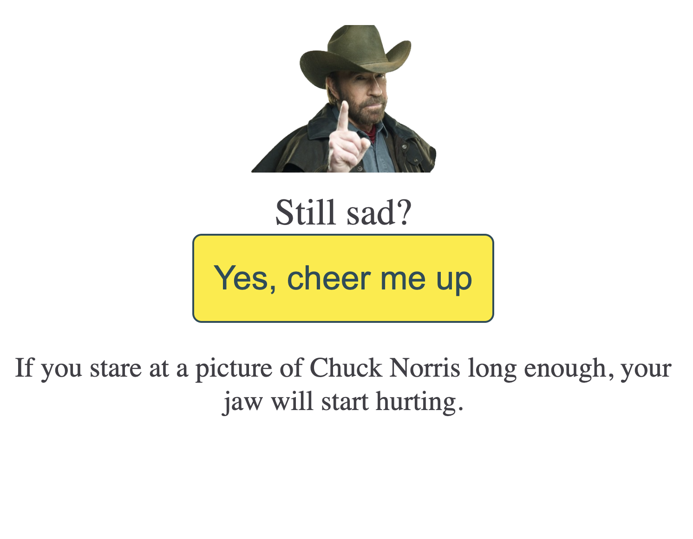

# Simple Cheer-me-up application

Cheer-me-up returns jokes and funny facts about Chuck Norris to cheer you up when you feel sad:



## The idea

This app is an example of integration API with React components.

## Run the project on your local

1. Clone from Github
2. Run these commands in the root of the project:

```
yarn && yarn start
```

You can use `npm` instead of `yarn` if you prefer it more.

3. Open [http://localhost:3000](http://localhost:3000) to view App in the browser.
